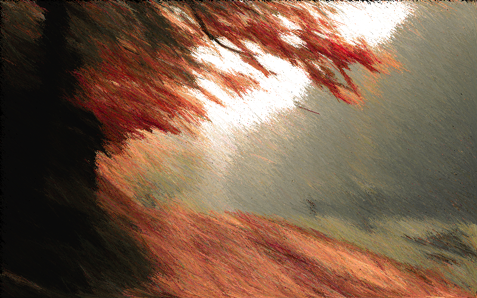

# `primitive`

[![primitive on Travis CI][travis-image]][travis]
[![primitive on crates.io][cratesio-image]][cratesio]
[![primitive license][license-image]][license]

[travis-image]: https://travis-ci.org/anthonynguyen/primitive.svg?branch=master
[travis]: https://travis-ci.org/anthonynguyen/primitive
[cratesio-image]: https://img.shields.io/crates/v/primitive.svg
[cratesio]: https://crates.io/crates/primitive
[license-image]: https://img.shields.io/github/license/anthonynguyen/primitive.svg
[license]: https://github.com/anthonynguyen/primitive/blob/master/LICENSE

primitive is a Rust program that approximates images by drawing random lines.

## Installing

Assuming you have Rust installed, run

```
cargo install primitive
```

Alternatively, you can run it from the source directory with

```
cargo run --release -- ...OPTIONS...
```

## Samples

**********

[Source](https://www.pexels.com/photo/high-angle-view-of-cityscape-against-cloudy-sky-313782/)


```
primitive -i sample/sample1_input.png -o sample/sample1_output.png -n 10000000 -l 10
```

**********

[Source](https://www.pexels.com/photo/autumn-daylight-fall-fog-589841/)




```
primitive -i sample/sample2_input.png -o sample/sample2_output.png -n 1000000 -l 40 --min-angle 20 --max-angle 60
```

## Usage

```
primitive 0.1.0
Anthony Nguyen <anknguyen@gmail.com>

USAGE:
    primitive [OPTIONS] --input <INPUT_FILE> [SUBCOMMAND]

FLAGS:
    -h, --help       Prints help information
    -V, --version    Prints version information

OPTIONS:
    -i, --input <INPUT_FILE>           Input filename
    -n, --iterations <NUM_ITERS>       Number of iterations to run [default: 1000000]
    -l, --line-length <LINE_LENGTH>    The length (in pixels) of the lines to draw [default: 25]
        --max-angle <MAX_ANGLE>        The maximum angle (in degrees) to generate [default: 360]
        --min-angle <MIN_ANGLE>        The minimum angle (in degrees) to generate [default: 0]
    -o, --output <OUTPUT_FILE>         Output filename

SUBCOMMANDS:
    bench    Runs in benchmark mode
    help     Prints this message or the help of the given subcommand(s)
```

## License

`primitive` is licensed under the MIT license. Please see the `LICENSE` file for
more details.
